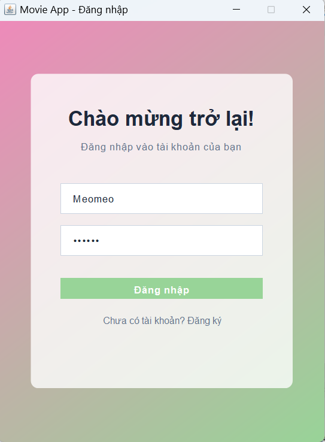
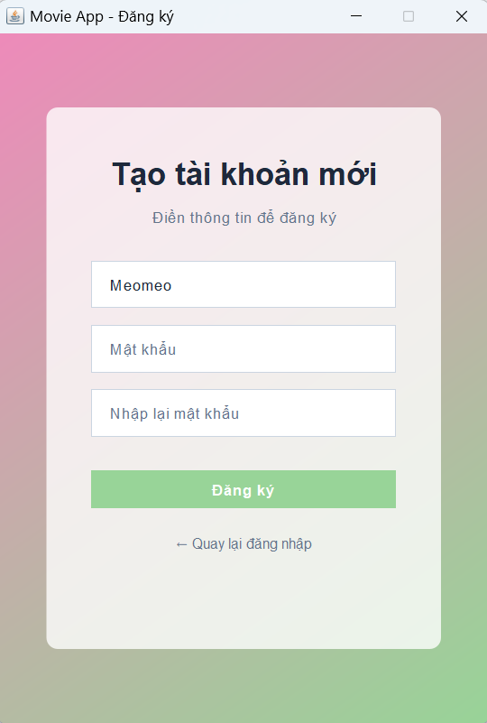
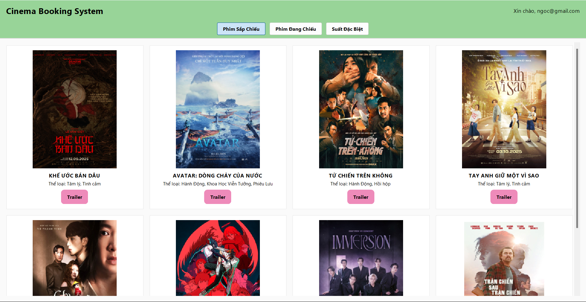
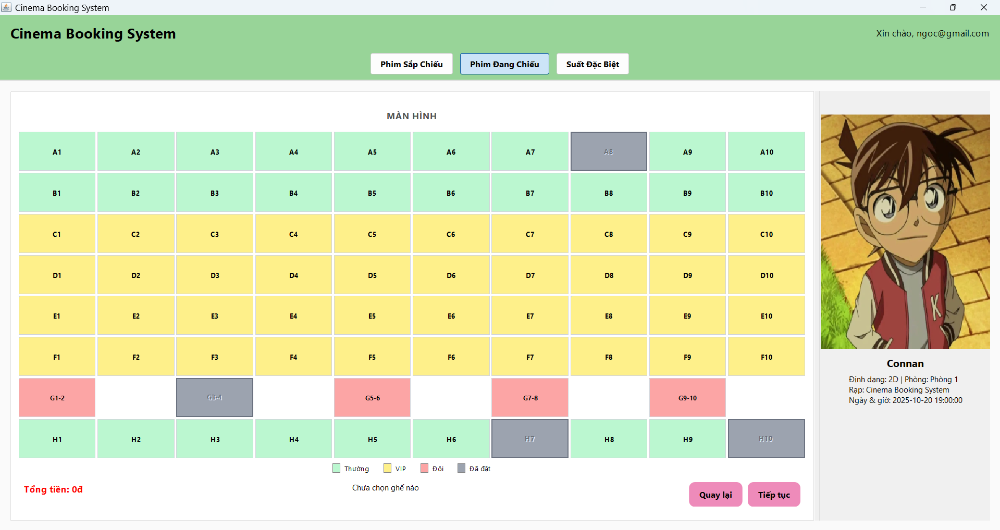
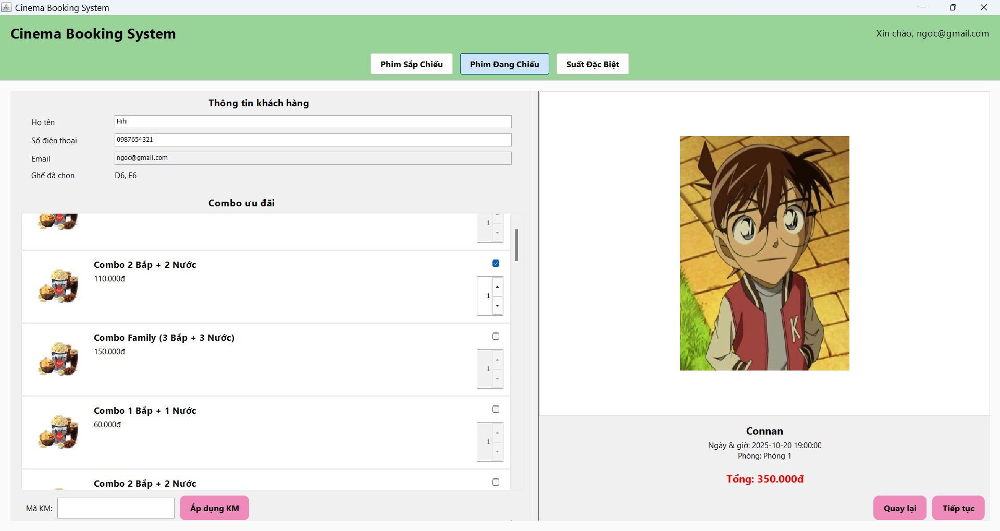
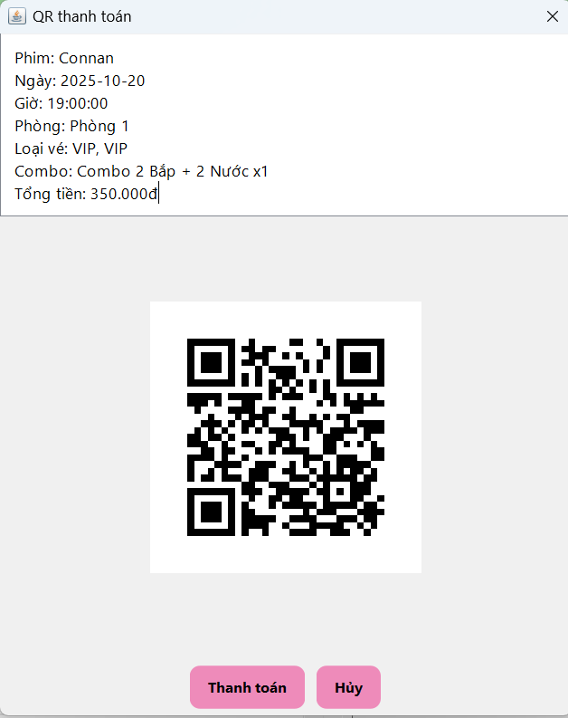
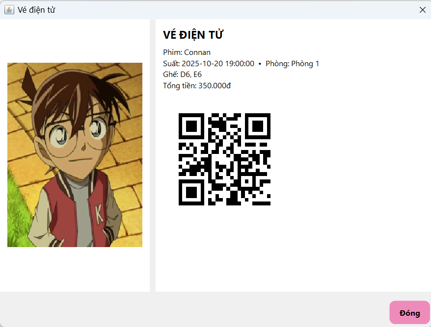
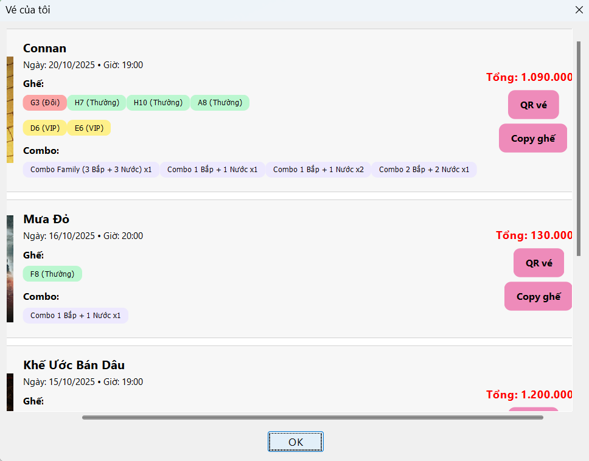
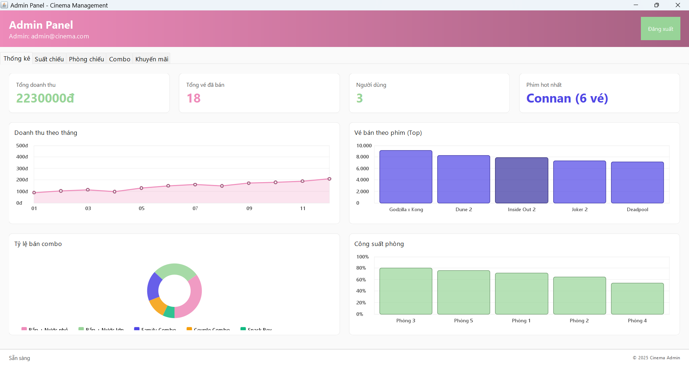

<h2 align="center">
    <a href="https://dainam.edu.vn/vi/khoa-cong-nghe-thong-tin">
    🎓 Faculty of Information Technology (DaiNam University)
    </a>
</h2>
<h2 align="center">
   NETWORK PROGRAMMING
</h2>
<div align="center">
    <p align="center">
        
        
        
    </p>

[](https://www.facebook.com/DNUAIoTLab)
[](https://dainam.edu.vn/vi/khoa-cong-nghe-thong-tin)
[](https://dainam.edu.vn)

</div>

## 📖 1. Giới thiệu
Ứng dụng đặt vé xem phim dùng để đặt vé xem phim có các Chức năng 1. Chức năng 2. 


làm theo các bước sau:
1. giới thiệu hệ thống
2. Công nghệ sử dụng
3. Một số hình ảnh
4. Các bước cài đặt
5. Liên hệ cá nhân
=======

---
<h1 align="center">HỆ THỐNG ĐẶT VÉ XEM PHIM</h1>

# 📖 1. Giới thiệu
Hệ thống **Cinema Booking** là một giải pháp phần mềm hiện đại được thiết kế để hỗ trợ người dùng đặt vé xem phim thông qua mô hình **máy khách – máy chủ**. Ứng dụng cung cấp chức năng quản lý suất chiếu, ghế ngồi, combo bắp nước, khuyến mãi và tạo vé điện tử có mã QR tiện lợi.  

Đề tài tập trung xây dựng một hệ thống đặt vé theo kiến trúc client-server, trong đó:  
- **Máy chủ (Server)** chịu trách nhiệm xử lý logic nghiệp vụ, kết nối và quản lý cơ sở dữ liệu MySQL.  
- **Máy khách (Client)** cung cấp giao diện đồ họa trực quan, giúp người dùng thao tác đặt vé dễ dàng.  

📊 **Tài liệu tiêu đề**  
- Xây dựng hệ thống đặt vé xem phim theo mô hình client-server  
- Triển khai giao thức TCP cho việc truyền thông tin đặt vé đáng tin cậy  
- Phát triển giao diện người dùng bằng Java Swing  
- Kết nối cơ sở dữ liệu MySQL để lưu trữ thông tin phim, suất chiếu, ghế, đơn đặt và khuyến mãi  
- Đảm bảo tính toàn vẹn dữ liệu với khóa ngoại và ràng buộc quan hệ  
- Hỗ trợ khuyến mãi, combo bắp nước và QR Code xác nhận vé  

---

# 🔧 2. Sử dụng trình cài đặt ngôn ngữ:  [](https://www.java.com/)

## 🌐 Ngôn Ngữ Lập Trình  
- **Java SE 17+**: Nền tảng chính  
- **Tính năng**: Hướng đối tượng, đa luồng, kết nối mạng  
- **Ứng dụng**: Viết toàn bộ client, server và business logic  

## 🎨 Giao Diện Người Dùng  
- **Java Swing**: Thư viện GUI cho ứng dụng desktop  
- **JFrame**: Container chính cho các cửa sổ (Login, Movie List, Trailer…)  
- **JPanel**: Quản lý bố cục hiển thị phim, ghế, thanh toán  
- **Thành phần Swing**: `JButton`, `JTable`, `JTextField`, `JPasswordField`…  
- **Xử lý sự kiện**: `ActionListener`, `MouseListener` để bắt thao tác người dùng  

## 🌐 Truyền Thông Mạng  
- **Giao thức TCP/IP**: Đảm bảo truyền thông tin đặt vé ổn định  
- **Lập trình Socket**: Sử dụng `Socket` và `ServerSocket` trong Java  
- **Port**: 12345 cho kết nối client-server  
- **Luồng đối tượng**: `ObjectInputStream` / `ObjectOutputStream` để trao đổi dữ liệu  

## 🗄️ Cơ Sở Dữ Liệu  
- **MySQL 8+**: Hệ quản trị cơ sở dữ liệu  
- **Trình điều khiển JDBC**: `mysql-connector-java`  
- **Lược đồ cơ sở dữ liệu**: Quản lý bảng `Users`, `Shows`, `Bookings`, `Combos`, `Promotions`  
- **Các thao tác SQL**: `SELECT`, `INSERT`, `UPDATE`, `DELETE` kèm ràng buộc `FOREIGN KEY` và `UNIQUE` để ngăn trùng ghế  

## 🔄 Xử Lý Đa Luồng  
- **Java Multithreading**: Cho phép nhiều client đặt vé cùng lúc  
- **Thread**: Mỗi kết nối client được xử lý bởi một luồng riêng trên server  
- **Đồng bộ hóa**: Đảm bảo tránh xung đột dữ liệu khi nhiều người cùng đặt một suất chiếu  

--

# 🖼️ 3. Hình ảnh chức năng 

> Bạn có thể thay ảnh thật của project vào thư mục `docs/images/` với đúng tên file hoặc sửa đường dẫn bên dưới.

1. **Đăng nhập**
   - Người dùng nhập email + mật khẩu.
   - Kiểm tra thông tin trong bảng `Users`.
   - Nếu hợp lệ → chuyển sang giao diện đặt vé.

   

2. **Đăng ký**
   - Người dùng nhập email + mật khẩu.
   - Đăng ký

   

3. **Trang danh sách các phim**
   - Hiển thị phim sắp chiếu, phim đang chiếu, phim đặc biệt
   - Xem trailer, chi tiết phim, đặt vé

   

4. **Đặt ghế**
   - Hiển thị 3 loại ghế để chọn
 

5. **Điền thông tin & chọn Combo**
   - Hiển thị from điền thông tin cá nhân
   - Chọn Combo + khuyến mãi

    

5. **Thanh toán**
   - Tổng hợp thông tin: phim, suất, ghế, combo, khuyến mãi.
   - Sinh **QR Code** (sử dụng `QRCodeUtil.java`).
   - Lưu dữ liệu vào MySQL (`Bookings`, `OrderCombos`, `BookingPromos`).
    

6. **Vé điện tử**
   - Tổng hợp thông tin: phim, suất, ghế, tổng tiền
   - Lưu dữ liệu vào MySQL (`Bookings`, `OrderCombos`, `BookingPromos`).
    

7. **Vé của tôi**
   - Lưu trữ tổng hợp các vé đã đặt
   - Xem QR, copy ghế
    

8. **Admin**
   - Hiển thị tổng doanh thu, tổng vé bán, tổng người dùng, phim hot
   - Biểu đồ thống kê doanh thu, vé bán, Công suất,..
   - Xem, sửa, xóa: Suất chiếu, phòng chiếu, combo, khuyến mãi
    
---

## 4. ⚙️ Các bước cài đặt
- **Java JDK 8+**
- **MySQL Server** (khuyến nghị 8.0+)
- IDE: **IntelliJ IDEA** hoặc **Eclipse**
- Trình điều khiển JDBC: **MySQL Connector/J** (thêm vào classpath của project)

### 4.2. Tạo database
Chạy file SQL để khởi tạo DB `cinema` và các bảng cần thiết (ví dụ trong MySQL Workbench/CLI).

### 4.3. Cấu hình kết nối DB
Trong `MovieServer.java`, sửa cấu hình JDBC cho phù hợp máy của bạn:
```java
String url = "jdbc:mysql://localhost:3306/cinema?useUnicode=true&characterEncoding=utf8";
String user = "root";
String password = "your_password";
```

### 4.4. Build & Run
1. Chạy `MovieServer.java` để khởi động server.
2. Chạy `MovieClient.java` để mở giao diện client.
3. Đăng nhập tài khoản mẫu:
   - **Email:** `ngoc@gmail.com`
   - **Password:** `123456`

### 4.5. Ghi chú xử lý đặt vé
- Khi chọn ghế dạng `F6, F1`, hãy tách thành hai bản ghi:
  ```sql
  INSERT INTO Bookings(showId, email, seat_row, seat_col) VALUES
  (:showId, :email, 'F', 6),
  (:showId, :email, 'F', 1);
  ```
- Nếu nhận lỗi `Duplicate entry` ở khóa `uq_bookings_seat`, nghĩa là ghế đã có người đặt → cần hiển thị thông báo phù hợp.

---

# 📞 5. Liên hệ  

Nếu bạn có bất kỳ thắc mắc hoặc cần hỗ trợ về dự án **Cinema Booking**, vui lòng liên hệ:  

- 👤 **Tác giả:** Phạm Thị Hồng Ngọc
- 🎓 **Lớp:** Công nghệ thông tin 
- 🏫 **Trường:** Đại học Đại Nam  
- 📧 **Email:** pthn2488@gmail.com  
- 📞 **SĐT:** 0395 888 778


Cảm ơn bạn đã quan tâm và sử dụng hệ thống hỗ trợ trợ cấp xã hội! ❤️

