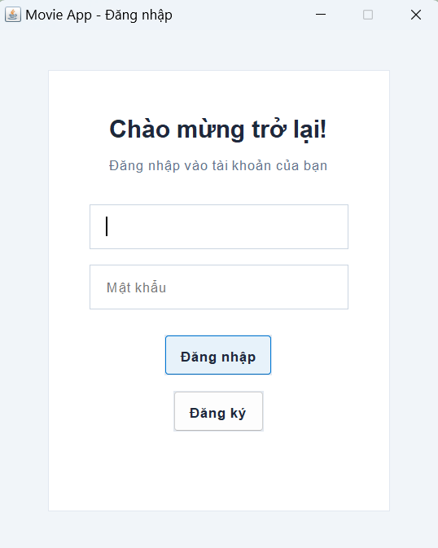
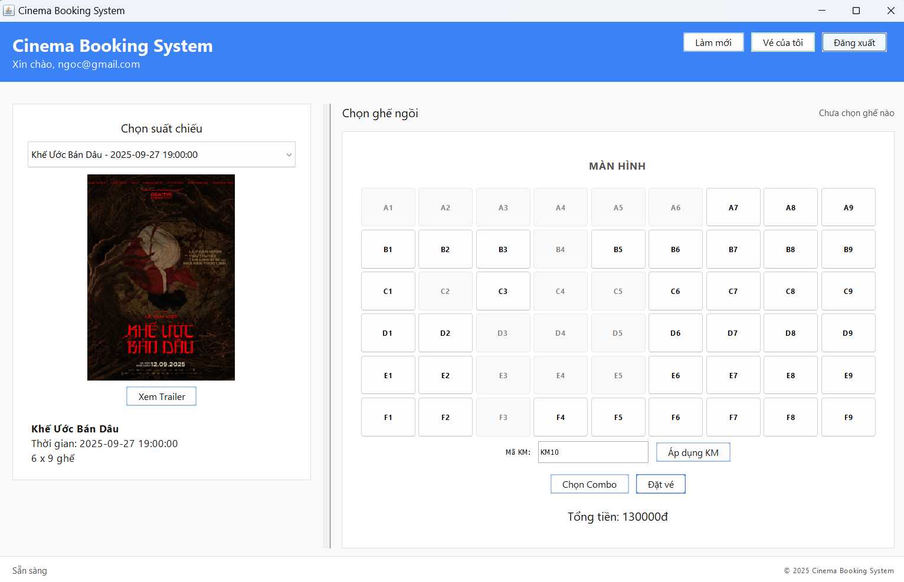
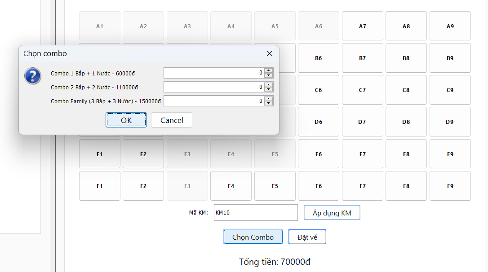
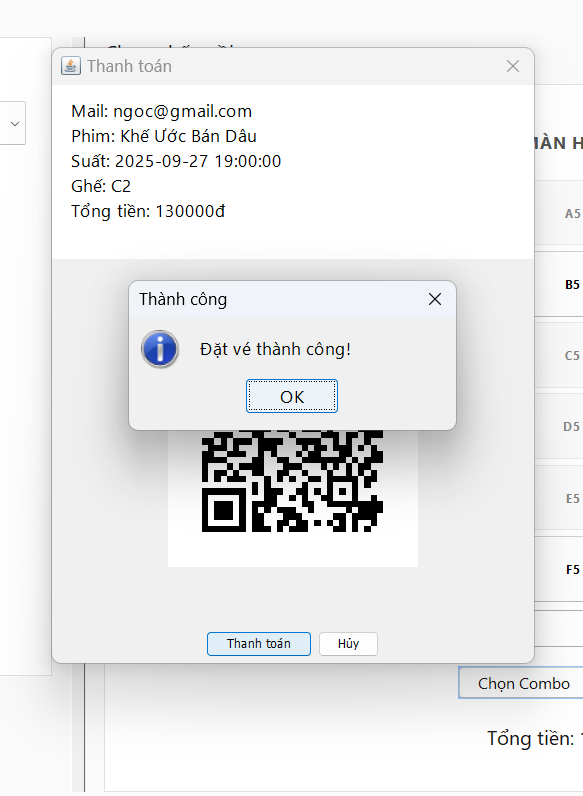

<h2 align="center">
    <a href="https://dainam.edu.vn/vi/khoa-cong-nghe-thong-tin">
    🎓 Faculty of Information Technology (DaiNam University)
    </a>
</h2>
<h2 align="center">
   NETWORK PROGRAMMING
</h2>
<div align="center">
    <p align="center">
        
        
        
    </p>

[](https://www.facebook.com/DNUAIoTLab)
[](https://dainam.edu.vn/vi/khoa-cong-nghe-thong-tin)
[](https://dainam.edu.vn)

</div>


<h1 align="center">HỆ THỐNG ĐẶT VÉ XEM PHIM</h1>

# 📖 1. Giới thiệu
Hệ thống **Cinema Booking** là một giải pháp phần mềm hiện đại được thiết kế để hỗ trợ người dùng đặt vé xem phim thông qua mô hình **máy khách – máy chủ**. Ứng dụng cung cấp chức năng quản lý suất chiếu, ghế ngồi, combo bắp nước, khuyến mãi và tạo vé điện tử có mã QR tiện lợi.  

Đề tài tập trung xây dựng một hệ thống đặt vé theo kiến trúc client-server, trong đó:  
- **Máy chủ (Server)** chịu trách nhiệm xử lý logic nghiệp vụ, kết nối và quản lý cơ sở dữ liệu MySQL.  
- **Máy khách (Client)** cung cấp giao diện đồ họa trực quan, giúp người dùng thao tác đặt vé dễ dàng.  

📊 **Tài liệu tiêu đề**  
- Xây dựng hệ thống đặt vé xem phim theo mô hình client-server  
- Triển khai giao thức TCP cho việc truyền thông tin đặt vé đáng tin cậy  
- Phát triển giao diện người dùng bằng Java Swing  
- Kết nối cơ sở dữ liệu MySQL để lưu trữ thông tin phim, suất chiếu, ghế, đơn đặt và khuyến mãi  
- Đảm bảo tính toàn vẹn dữ liệu với khóa ngoại và ràng buộc quan hệ  
- Hỗ trợ khuyến mãi, combo bắp nước và QR Code xác nhận vé  


# 🔧 2. Công nghệ sử dụng: [](https://www.java.com/)

## 🌐 Ngôn Ngữ Lập Trình  
- **Java SE 17+**: Nền tảng chính  
- **Tính năng**: Hướng đối tượng, đa luồng, kết nối mạng  
- **Ứng dụng**: Viết toàn bộ client, server và business logic  

## 🎨 Giao Diện Người Dùng  
- **Java Swing**: Thư viện GUI cho ứng dụng desktop  
- **JFrame**: Container chính cho các cửa sổ (Login, Movie List, Trailer…)  
- **JPanel**: Quản lý bố cục hiển thị phim, ghế, thanh toán  
- **Thành phần Swing**: `JButton`, `JTable`, `JTextField`, `JPasswordField`…  
- **Xử lý sự kiện**: `ActionListener`, `MouseListener` để bắt thao tác người dùng  

## 🌐 Truyền Thông Mạng  
- **Giao thức TCP/IP**: Đảm bảo truyền thông tin đặt vé ổn định  
- **Lập trình Socket**: Sử dụng `Socket` và `ServerSocket` trong Java  
- **Port**: 12345 cho kết nối client-server  
- **Luồng đối tượng**: `ObjectInputStream` / `ObjectOutputStream` để trao đổi dữ liệu  

## 🗄️ Cơ Sở Dữ Liệu  
- **MySQL 8+**: Hệ quản trị cơ sở dữ liệu  
- **Trình điều khiển JDBC**: `mysql-connector-java`  
- **Lược đồ cơ sở dữ liệu**: Quản lý bảng `Users`, `Shows`, `Bookings`, `Combos`, `Promotions`  
- **Các thao tác SQL**: `SELECT`, `INSERT`, `UPDATE`, `DELETE` kèm ràng buộc `FOREIGN KEY` và `UNIQUE` để ngăn trùng ghế  

## 🔄 Xử Lý Đa Luồng  
- **Java Multithreading**: Cho phép nhiều client đặt vé cùng lúc  
- **Thread**: Mỗi kết nối client được xử lý bởi một luồng riêng trên server  
- **Đồng bộ hóa**: Đảm bảo tránh xung đột dữ liệu khi nhiều người cùng đặt một suất chiếu  


# 🖼️ 3. Hình ảnh chức năng 

> Bạn có thể thay ảnh thật của project vào thư mục `docs` với đúng tên file hoặc sửa đường dẫn bên dưới.

1. **Đăng nhập**
   - Người dùng nhập email + mật khẩu.
   - Kiểm tra thông tin trong bảng `Users`.
   - Nếu hợp lệ → chuyển sang giao diện đặt vé.

<p align="center">
  
  <br>
  <em>Hình 1: Giao diện Đăng nhập</em>
</p>

2. **Danh sách phim & suất chiếu**
   - Hiển thị poster, trailer (cửa sổ từ `TrailerWindow.java`).
   - Người dùng chọn phim, chọn giờ chiếu.

<p align="center">
  
  <br>
  <em>Hình 2: Giao diện Danh sách & suất chiếu</em>
</p>

3. **Đặt vé & chọn ghế**
   - Hiển thị sơ đồ ghế theo `total_rows` và `total_cols` trong bảng `Shows`.
   - Ghế đã đặt hiển thị màu khác, không chọn được.
   - Cho phép chọn nhiều ghế cùng lúc (ví dụ: F6, F1).

<p align="center">
  
  <br>
  <em>Hình 3: Giao diện Đặt vé & chọn ghế</em>
</p>

4. **Thanh toán**
   - Tổng hợp thông tin: phim, suất, ghế, combo, khuyến mãi.
   - Sinh **QR Code** (sử dụng `QRCodeUtil.java`).
   - Lưu dữ liệu vào MySQL (`Bookings`, `OrderCombos`, `BookingPromos`).

<p align="center">
  
  <br>
  <em>Hình 4: Giao diện Thanh toán</em>
</p>


#🛠️ 4. Các bước cài đặt

##4.1. Cài đặt môi trường
Trước khi chạy chương trình, cần chuẩn bị các công cụ sau:
- Cài đặt **JDK 8+**: [Download Java](https://www.oracle.com/java/technologies/javase-downloads.html)  
- Cài đặt **MySQL Server** (khuyến nghị bản **8.0+**): [Download MySQL](https://dev.mysql.com/downloads/)  
- Cài đặt **Git** (nếu chưa có): [Download Git](https://git-scm.com/downloads)  
- IDE khuyến nghị: **IntelliJ IDEA** hoặc **Eclipse**  
- Thêm **MySQL Connector/J** (JDBC Driver) vào **classpath** của project: [Download Connector/J](https://dev.mysql.com/downloads/connector/j/)


## 4.2. Clone source code
Mở **Terminal / CMD** và chạy:

git clone https://github.com/your-repo/cinema-booking-system.git
cd cinema-booking-system

## 4.3. Khởi tạo cơ sở dữ liệu MySQL

Mở **MySQL Workbench** hoặc CLI và chạy:

```sql
CREATE DATABASE IF NOT EXISTS cinema
  CHARACTER SET utf8mb4
  COLLATE utf8mb4_unicode_ci;
USE cinema;

-- Bảng người dùng
CREATE TABLE IF NOT EXISTS Users (
    email VARCHAR(100) PRIMARY KEY,
    password VARCHAR(100) NOT NULL,
    fullname VARCHAR(100) NOT NULL,
    created_at TIMESTAMP DEFAULT CURRENT_TIMESTAMP
);

-- Bảng suất chiếu
CREATE TABLE IF NOT EXISTS Shows (
    id INT AUTO_INCREMENT PRIMARY KEY,
    title VARCHAR(200) NOT NULL,
    showtime DATETIME NOT NULL,
    total_rows INT NOT NULL,
    total_cols INT NOT NULL,
    poster VARCHAR(255),
    trailer VARCHAR(255)
);

-- Bảng đặt ghế
CREATE TABLE IF NOT EXISTS Bookings (
    id INT AUTO_INCREMENT PRIMARY KEY,
    showId INT NOT NULL,
    email VARCHAR(100) NOT NULL,
    seat_row VARCHAR(5) NOT NULL, -- lưu A, B, C...
    seat_col INT NOT NULL,
    created_at TIMESTAMP DEFAULT CURRENT_TIMESTAMP,
    FOREIGN KEY (showId) REFERENCES Shows(id) ON DELETE CASCADE,
    FOREIGN KEY (email) REFERENCES Users(email) ON DELETE CASCADE,
    UNIQUE KEY uq_bookings_seat (showId, seat_row, seat_col)
);

-- Bảng combo bắp nước
CREATE TABLE IF NOT EXISTS Combos (
    id INT AUTO_INCREMENT PRIMARY KEY,
    name VARCHAR(100) NOT NULL,
    price INT NOT NULL
);

-- Bảng order combo
CREATE TABLE IF NOT EXISTS OrderCombos (
    id INT AUTO_INCREMENT PRIMARY KEY,
    showId INT NOT NULL,
    email VARCHAR(100) NOT NULL,
    comboId INT NOT NULL,
    quantity INT NOT NULL,
    created_at TIMESTAMP DEFAULT CURRENT_TIMESTAMP,
    FOREIGN KEY (showId) REFERENCES Shows(id) ON DELETE CASCADE,
    FOREIGN KEY (email) REFERENCES Users(email) ON DELETE CASCADE,
    FOREIGN KEY (comboId) REFERENCES Combos(id) ON DELETE CASCADE
);

-- Bảng khuyến mãi
CREATE TABLE IF NOT EXISTS Promotions (
    code VARCHAR(50) PRIMARY KEY,
    discount INT NOT NULL CHECK (discount BETWEEN 0 AND 100),
    expiry DATE NOT NULL
);

-- Liên kết booking với mã khuyến mãi
CREATE TABLE IF NOT EXISTS BookingPromos (
    id INT AUTO_INCREMENT PRIMARY KEY,
    showId INT NOT NULL,
    email VARCHAR(100) NOT NULL,
    promoCode VARCHAR(50) NOT NULL,
    created_at TIMESTAMP DEFAULT CURRENT_TIMESTAMP,
    FOREIGN KEY (showId) REFERENCES Shows(id) ON DELETE CASCADE,
    FOREIGN KEY (email) REFERENCES Users(email) ON DELETE CASCADE,
    FOREIGN KEY (promoCode) REFERENCES Promotions(code) ON DELETE CASCADE
);

-- Dữ liệu mẫu
INSERT INTO Users(email, password, fullname)
VALUES ('ngoc@gmail.com', '123456', 'NgocDay')
ON DUPLICATE KEY UPDATE fullname=VALUES(fullname);

INSERT INTO Shows(title, showtime, total_rows, total_cols, poster, trailer) VALUES
('Khế Ước Bán Dâu', '2025-09-27 19:00:00', 6, 9,
 'https://files.betacorp.vn/media%2fimages%2f2025%2f08%2f01%2f400x633-094149-010825-91.jpg',
 'https://www.youtube.com/embed/eFV2eSaDsp4?si=WoJRZzGSnXoJWx0p&controls=0'),
('Mưa Đỏ', '2025-09-22 20:00:00', 6, 10,
 'https://files.betacorp.vn/media%2fimages%2f2025%2f08%2f22%2f400x633-8-181310-220825-58.jpg',
 'https://www.youtube.com/embed/RZRb5K2aK4E?si=3ryjWqnLZa1BRzxp&controls=0');

INSERT INTO Combos(name, price) VALUES
('Combo 1 Bắp + 1 Nước', 60000),
('Combo 2 Bắp + 2 Nước', 110000),
('Combo Family (3 Bắp + 3 Nước)', 150000);

INSERT INTO Promotions(code, discount, expiry) VALUES
('KM10', 10, '2025-12-31'),
('KM20', 20, '2025-12-31');
```

---

## 4.4. Cấu hình kết nối JDBC

Mở file `MovieServer.java` và cập nhật cấu hình:

```java
String url = "jdbc:mysql://localhost:3306/cinema?useUnicode=true&characterEncoding=utf8";
String user = "root";          // thay bằng user MySQL của bạn
String password = "your_password"; // thay bằng mật khẩu MySQL
```

**Giải thích nhanh:**

* `url`: địa chỉ DB (mặc định `localhost:3306`, DB name `cinema`).
* `user`: tài khoản MySQL (thường là `root`).
* `password`: mật khẩu MySQL của bạn.

---

## 4.5. Chạy chương trình

#### Chạy Server

1. Mở file `MovieServer.java`.
2. Run chương trình → server khởi động, lắng nghe kết nối.

#### Chạy Client

1. Mở file `MovieClient.java`.
2. Run chương trình → giao diện đặt vé hiển thị.
3. Đăng nhập test:

   * **Email:** `ngoc@gmail.com`
   * **Password:** `123456`

---

## 4.6. Kiểm tra đặt vé & xử lý lỗi

* Khi chọn nhiều ghế như `F6, F1`, lưu thành nhiều bản ghi:

```sql
INSERT INTO Bookings(showId, email, seat_row, seat_col) VALUES
(:showId, :email, 'F', 6),
(:showId, :email, 'F', 1);
```

* Nếu gặp lỗi **`Duplicate entry`** tại khóa `uq_bookings_seat` → ghế đã có người đặt.
  → Hiển thị thông báo để người dùng chọn ghế khác.


# 📞 5. Liên hệ  

Nếu bạn có bất kỳ thắc mắc hoặc cần hỗ trợ về dự án **Cinema Booking**, vui lòng liên hệ:  

- 👨‍🎓 **Sinh viên thực hiện**: Phạm Thị Hồng Ngọc 
- 🎓 **Khoa**: Công nghệ thông tin – Đại học Đại Nam  
- 📧 **Email**: pthn2488@gmail.com


